# Robot-shop: The three tier architecture deployment on Azure Kubernetes Deployment (AKS)
This project demonstrates the three tier architecture contains 12 microservices on Azure Kubernetes Services (AKS). It's an cloned application from IBM Instana open source project.

## Application details
Stan's Robot Shop is a sample microservice application you can use as a sandbox to test and learn containerised application orchestration and monitoring techniques. It is not intended to be a comprehensive reference example of how to write a microservices application, although you will better understand some of those concepts by playing with Stan's Robot Shop. To be clear, the error handling is patchy and there is not any security built into the application.

This sample microservice application has been built using these technologies:

- NodeJS (Express)
- Java (Spring Boot)
- Python (Flask)
- Golang
- PHP (Apache)
- MongoDB
- Redis
- MySQL (Maxmind data)
- RabbitMQ
- Nginx
- AngularJS (1.x)

If you're the developer/architect interested to expand the knowledge on how microservices is implementated on different programming language, kindly visit - [Origin repo](https://github.com/instana/robot-shop). Also it provides other deployment option like Docker swarm, EKS, Openshift etc.

## What is implemented as part of the robot-shop cloned project ?

**Main Purpose:** Enabled Gateway API with Azure Application Gateway for Containers for unified north-south ingress and basic east-west traffic management, leveraging the GAMMA specification for service-to-service routing without the overhead of a full service mesh.

**Learning Part:**:
- Utilized Gateway API for Ingress traffic(north-to-south) - Azure Load Balancer + Azure Gateway for Containers which handles external traffic
- Re-write our own values.yaml for the helm based deployment in AKS cluster
- Enabled csi-drivers in AKS for redis database statefulset
- [Application Gateway for Containers](https://learn.microsoft.com/en-in/azure/application-gateway/for-containers/overview)

## Architecture model for our deployment

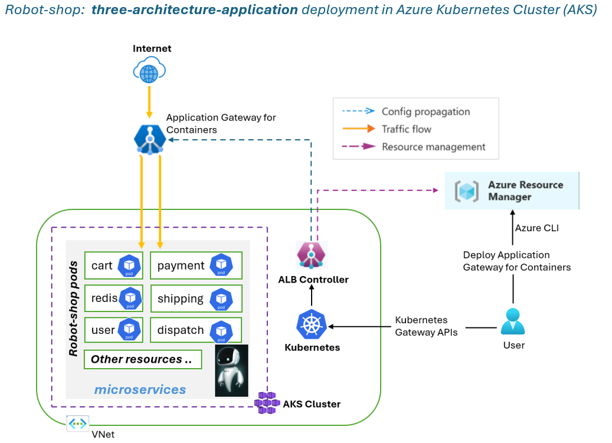

# Implementation Guide for application deployment

**Prerequisite:**

- Ensure you have Azure Account with Azure CLI, Helm, kubectl is installed
- Keep it ready with Resource Groups, Virtual networks and subnets with sufficient address space

### Create the Azure Kubernetes Service
Create AKS cluster with enable Workload Identity support on your AKS cluster
```bash
AKS_NAME='<your cluster name>'
RESOURCE_GROUP='<your resource group name>'
LOCATION='northeurope'
VM_SIZE='<the size of the vm in AKS>' 

az aks create --resource-group $RESOURCE_GROUP --name $AKS_NAME --location $LOCATION --node-vm-size $VM_SIZE --network-plugin azure --enable-oidc-issuer --enable-workload-identity --generate-ssh-key
```

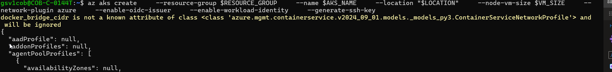

### Install the ALB Controller
Create a user managed identity for ALB controller and federate the identity as Workload Identity to use in the AKS cluster. ALB Controller requires a federated credential with the name of azure-alb-identity. Any other federated credential name is unsupported.
```bash
RESOURCE_GROUP='<your resource group name>'
AKS_NAME='<your aks cluster name>'
IDENTITY_RESOURCE_NAME='azure-alb-identity'

mcResourceGroup=$(az aks show --resource-group $RESOURCE_GROUP --name $AKS_NAME --query "nodeResourceGroup" -o tsv)
mcResourceGroupId=$(az group show --name $mcResourceGroup --query id -otsv)

az identity create --resource-group $RESOURCE_GROUP --name $IDENTITY_RESOURCE_NAME
principalId="$(az identity show -g $RESOURCE_GROUP -n $IDENTITY_RESOURCE_NAME --query principalId -otsv)"

az role assignment create --assignee-object-id $principalId --assignee-principal-type ServicePrincipal --scope $mcResourceGroupId --role "acdd72a7-3385-48ef-bd42-f606fba81ae7"

AKS_OIDC_ISSUER="$(az aks show -n "$AKS_NAME" -g "$RESOURCE_GROUP" --query "oidcIssuerProfile.issuerUrl" -o tsv)"
az identity federated-credential create --name "azure-alb-identity" --identity-name "$IDENTITY_RESOURCE_NAME" --resource-group $RESOURCE_GROUP --issuer "$AKS_OIDC_ISSUER" --subject "system:serviceaccount:azure-alb-system:alb-controller-sa"
```
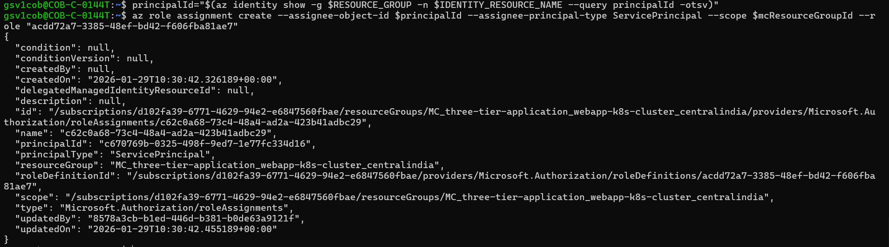

### Install ALM Controller using Helm

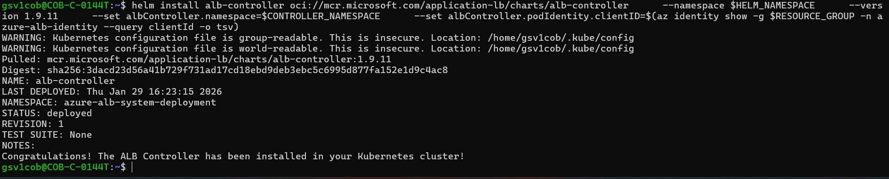

### Verify the ALB Installation
```bash
kubectl get pods -n azure-alb-system
```
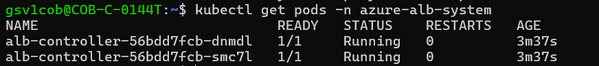

### Verify GatewayClass azure-alb-external is installed on your cluster
```bash
kubectl get gatewayclass azure-alb-external -o yaml
```
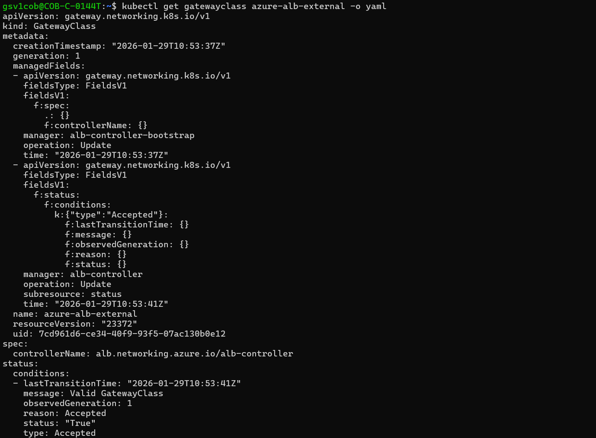

## Create Application Gateway for Controllers
The next step is to link your ALB controller to Application Gateway for Containers. How you create this link depends on your deployment strategy.

- Option 1: **Bring your own (BYO) deployment** - Everything managed by us
- Option 2: **Managed by ALB controller** - Managed by **ApplicationLoadBalancer** custom resource

**We are going with Option 1:** In this deployment strategy, deployment and lifecycle of the Application Gateway for Containers resource, Association resource, and Frontend resource is assumed via Azure portal, CLI, PowerShell, Terraform, etc. and referenced in configuration within Kubernetes.

**Note:** Ensure you have first deployed ALB Controller into your Kubernetes cluster before moving to next steps.

Execute the following command to create the Application Gateway for Containers resource.
```bash
RESOURCE_GROUP='<your resource group name>'
AGFC_NAME='alb-test'
az network alb create -g $RESOURCE_GROUP -n $AGFC_NAME
```
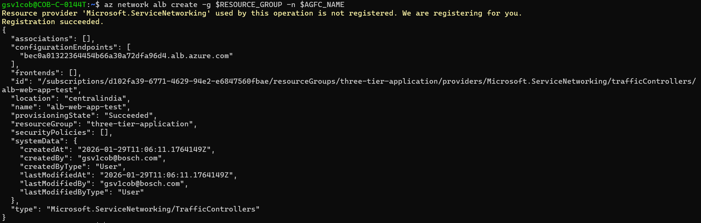

## Create an association resource
### Create a frontend resource
Execute the following command to create the Application Gateway for Containers frontend resource.
```bash
FRONTEND_NAME='test-frontend'
az network alb frontend create -g $RESOURCE_GROUP -n $FRONTEND_NAME --alb-name $AGFC_NAME
```
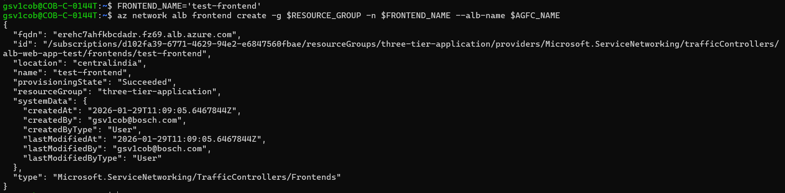

### Delegate a subnet to association resource
```bash
VNET_NAME='<name of the virtual network to use>'
VNET_RESOURCE_GROUP='<the resource group of your VNET>'
ALB_SUBNET_NAME='subnet-alb'
az network vnet subnet update --resource-group $VNET_RESOURCE_GROUP --name $ALB_SUBNET_NAME --vnet-name $VNET_NAME --delegations 'Microsoft.ServiceNetworking/trafficControllers'
ALB_SUBNET_ID=$(az network vnet subnet list --resource-group $VNET_RESOURCE_GROUP --vnet-name $VNET_NAME --query "[?name=='$ALB_SUBNET_NAME'].id" --output tsv)
echo $ALB_SUBNET_ID
```
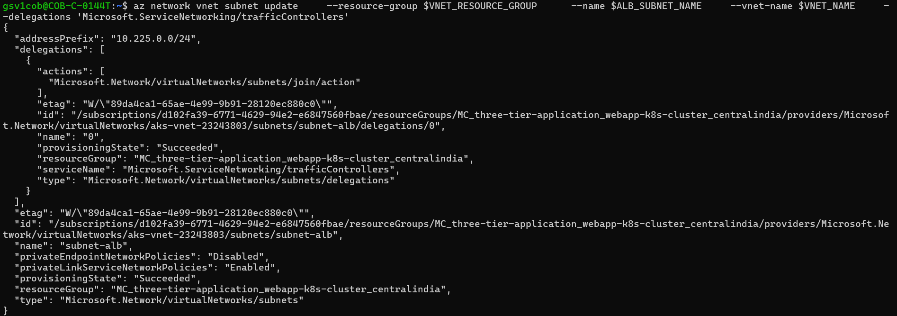

- Delegate permissions to managed identity
```bash
IDENTITY_RESOURCE_NAME='azure-alb-identity'

resourceGroupId=$(az group show --name $RESOURCE_GROUP --query id -otsv)
principalId=$(az identity show -g $RESOURCE_GROUP -n $IDENTITY_RESOURCE_NAME --query principalId -otsv)

# Delegate AppGw for Containers Configuration Manager role to RG containing Application Gateway for Containers resource
az role assignment create --assignee-object-id $principalId --assignee-principal-type ServicePrincipal --scope $resourceGroupId --role "fbc52c3f-28ad-4303-a892-8a056630b8f1"

# Delegate Network Contributor permission for join to association subnet
az role assignment create --assignee-object-id $principalId --assignee-principal-type ServicePrincipal --scope $ALB_SUBNET_ID --role "4d97b98b-1d4f-4787-a291-c67834d212e7"
```
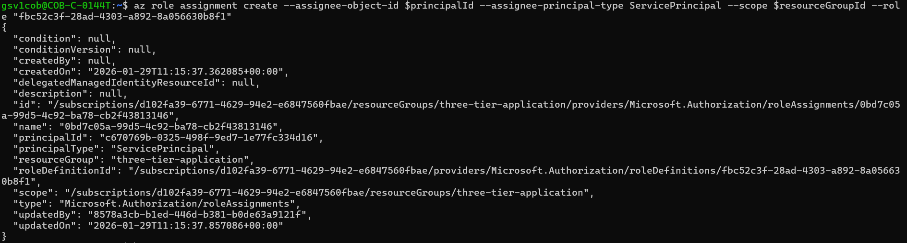

### Create an association resource
```bash
ASSOCIATION_NAME='association-test'
az network alb association create -g $RESOURCE_GROUP -n $ASSOCIATION_NAME --alb-name $AGFC_NAME --subnet $ALB_SUBNET_ID
```
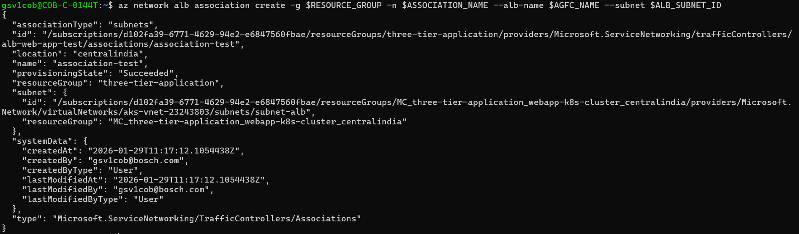

# Manual Deployment Steps - Robot Shop on AKS

**Prerequisites Check:**
```bash
# 1. Verify kubectl is connected to your AKS cluster
kubectl cluster-info
kubectl get nodes

# 2. Verify your gateway exists
kubectl get gateway -A
# You should see: gateway-01 in web-app namespace

# 3. Get gateway address
kubectl get gateway gateway-01 -n web-app -o jsonpath='{.status.addresses[0].value}'

# Should show: erehc7ahfkbcdadr.fz69.alb.azure.com (Example ALB URL)
```
## Step 1: Create Namespace
```bash
kubectl create namespace web-app
```
## Step 2: Create Azure Disk StorageClass for Redis Cache
```bash
cat <<EOF | kubectl apply -f -
apiVersion: storage.k8s.io/v1
kind: StorageClass
metadata:
  name: managed-csi-premium
provisioner: disk.csi.azure.com
parameters:
  skuName: Premium_LRS
  kind: Managed
  cachingMode: ReadOnly
reclaimPolicy: Delete
volumeBindingMode: WaitForFirstConsumer
allowVolumeExpansion: true
EOF
```
**Verify:**
```bash
kubectl get storageclass managed-csi-premium
```

## Step 3: Clone the Repository
```bash
# Clone the repository
git clone https://github.com/cloudvignesh/robotshop-microservices.git

# Navigate to the helm directory
cd robotshop-microservices/helm
```
## Step 4: Review the Helm Chart
```bash
# List files in the helm directory
ls -la

# View the Chart.yaml
cat Chart.yaml

# View default values
cat values.yaml
```
## Step 5:  Deploy with Helm
```bash
# Deploy with custom values file
helm install robot-shop . -n web-app -f values.yaml --wait
```

## Step 6: Monitor Deployment
```bash
# Watch pods being created
kubectl get pods -n web-app -w

# In another terminal, check deployment progress
kubectl get all -n web-app

# Check events
kubectl get events -n web-app --sort-by='.lastTimestamp'
```
Wait until all pods show Running status. This may take 3-5 minutes.

## Step 7: Verify Deployments
```bash
# Check all pods are running
kubectl get pods -n web-app
# All pods should show STATUS as Running

# Check services
kubectl get svc -n web-app
# Should see services for web, redis, mongodb, catalogue, cart, user, payment, shipping, ratings

# Check PVCs
kubectl get pvc -n web-app
# Should see redis and mongodb PVCs with STATUS as Bound

# Check PVs
kubectl get pv
# Should see corresponding persistent volumes
```

## Step 8: Deploy the required Gateway API resources
```bash
RESOURCE_GROUP='<resource group name of the Application Gateway For Containers resource>'
RESOURCE_NAME='alb-test' # give any appropriate name

RESOURCE_ID=$(az network alb show --resource-group $RESOURCE_GROUP --name $RESOURCE_NAME --query id -o tsv)
FRONTEND_NAME='frontend'
```
```yaml
kubectl apply -f - <<EOF
apiVersion: gateway.networking.k8s.io/v1
kind: Gateway
metadata:
  name: gateway-01
  namespace: web-app
  annotations:
    alb.networking.azure.io/alb-id: $RESOURCE_ID
spec:
  gatewayClassName: azure-alb-external
  listeners:
  - name: http
    port: 80
    protocol: HTTP
    allowedRoutes:
      namespaces:
        from: Same
  addresses:
  - type: alb.networking.azure.io/alb-frontend
    value: $FRONTEND_NAME
EOF
```
Once the gateway resource is created, ensure the status is valid, the listener is Programmed, and an address is assigned to the gateway.

```bash
kubectl get gateway gateway-01 -n test-infra -o yaml
```
Example output of successful gateway creation.

```yaml
status:
  addresses:
  - type: Hostname
    value: xxxx.yyyy.alb.azure.com
  conditions:
  - lastTransitionTime: "2023-06-19T21:04:55Z"
    message: Valid Gateway
    observedGeneration: 1
    reason: Accepted
    status: "True"
    type: Accepted
  - lastTransitionTime: "2023-06-19T21:04:55Z"
    message: Application Gateway For Containers resource has been successfully updated.
    observedGeneration: 1
    reason: Programmed
    status: "True"
    type: Programmed
  listeners:
  - attachedRoutes: 0
    conditions:
    - lastTransitionTime: "2023-06-19T21:04:55Z"
      message: ""
      observedGeneration: 1
      reason: ResolvedRefs
      status: "True"
      type: ResolvedRefs
    - lastTransitionTime: "2023-06-19T21:04:55Z"
      message: Listener is accepted
      observedGeneration: 1
      reason: Accepted
      status: "True"
      type: Accepted
    - lastTransitionTime: "2023-06-19T21:04:55Z"
      message: Application Gateway For Containers resource has been successfully updated.
      observedGeneration: 1
      reason: Programmed
      status: "True"
      type: Programmed
    name: gateway-01-http
    supportedKinds:
    - group: gateway.networking.k8s.io
      kind: HTTPRoute
```
## Step 9: Create an HTTPRoute for robot-shop service

```yaml
kubectl apply -f - <<EOF
apiVersion: gateway.networking.k8s.io/v1
kind: HTTPRoute
metadata:
  name: robot-shop-route
  namespace: web-app
spec:
  parentRefs:
  - name: gateway-01
  rules:
  - backendRefs:
    - name: web
      port: 8080
      weight: 1

EOF
```
Once the HTTPRoute resource is created, ensure the route is Accepted and the Application Gateway for Containers resource is Programmed.

```bash
kubectl get robot-shop-route -n web-app -o yaml
```

## Step 10: Access the robot-shop application using FQDN from application Gateway for Containers
- Go to **Application Gateway for Containers** resource from Azure portal
- Select **Frontends** from settings
- Copy the **test-frontend** (name of the frontend, it could be different name in your case)
- Example: **http://erehc7ahfkbcdadr.fz69.alb.azure.com**

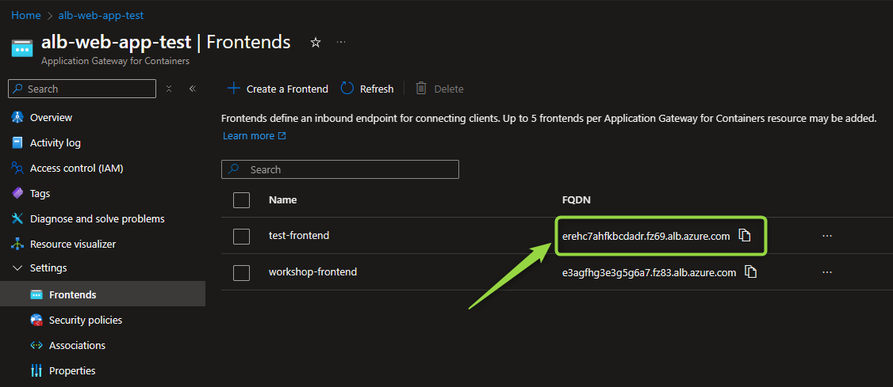

Now, copy and paste the URL in Incognito browser to access the **ROBOT-SHOP E-COMMERCE PLATFORM** 🎉

**Main page:**
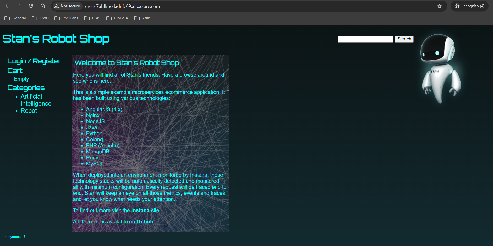

**Login Page:**
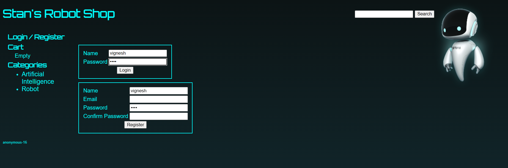

**Previous Order history:**
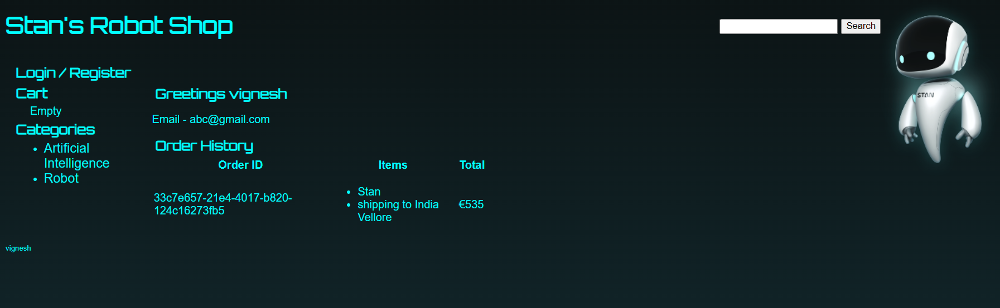

**View Robot products:**
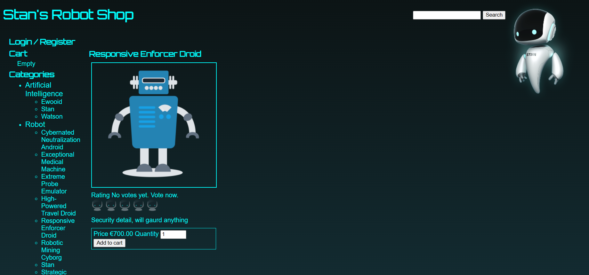

**Add products to the cart:**
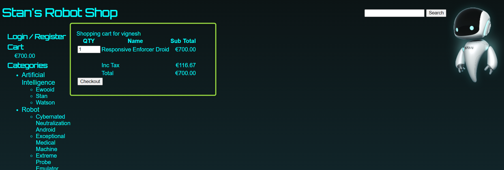

**Enter shipping address and pay now:**
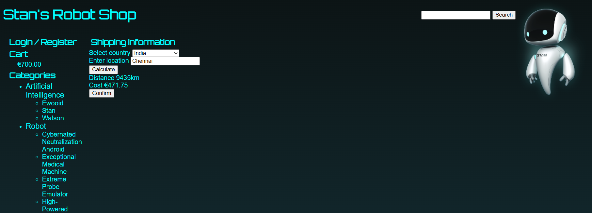

**Place the order:**
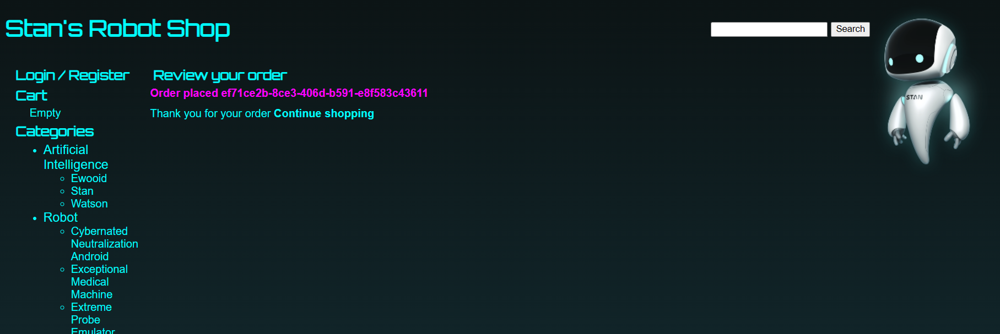 

# Roadmap

- [ ] Implement data plane layer for east-to-west(service-to-service) communication with a Service Mesh Istio or Linkerd
- [ ] Create terraform modules for infrastructure
- [ ] Implement CI/CD pipelines for automated deployments for terraform
- [ ] Configure Azure DNS with records for host domain and add CNAME record that re-directs to ALB URL. So that user access the app with custom domain
---

**Built by [cloudvignesh](https://github.com/cloudvignesh)**